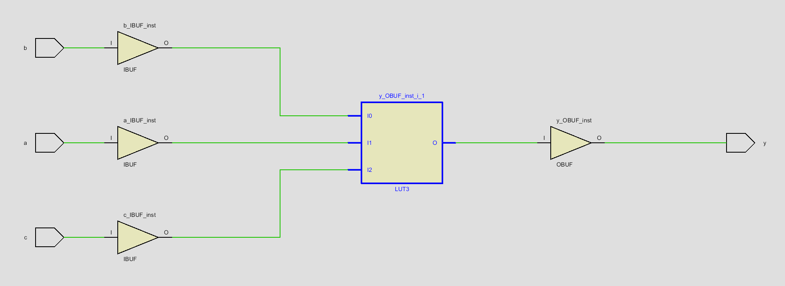
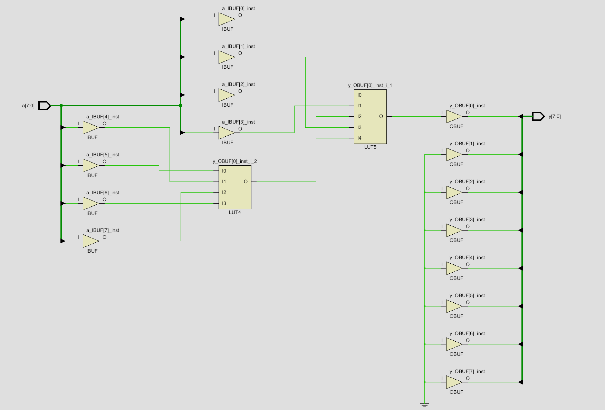

# Combinational Logic Modules

This folder contains SystemVerilog combinational logic modules created while working through Chapter 4 of *Digital Design and Computer Architecture: RISC-V Edition*.

## Modules

### myFirstModule

Implements a combinational Boolean function with three 1-bit inputs and one 1-bit output.

#### SystemVerilog

```systemverilog
assign y = (~a & ~b & ~c) |
           ( a & ~b & ~c) |
           ( a & ~b &  c);
```

#### Synthesis Result



### reductionOperators 

Uses the SystemVerilog reduction AND operator to combine all eight bits of the input into one output.

#### SystemVerilog

```systemverilog
assign y = &a;
```

This is equivalent to:

```systemverilog
assign y = a[7] & a[6] & a[5] & a[4] &
           a[3] & a[2] & a[1] & a[0];
```

#### Synthesis Result 



### functionSelector

Implements a 4-bit combinational function selector. A 2-bit select input chooses which operation is performed on the two 4-bit inputs, a and b. 

#### SystemVerilog

```systemverilog
module functionSelector(
    input  logic [3:0] a,
    input  logic [3:0] b,
    input  logic [1:0] select,
    output logic [3:0] y
);

    assign y =
        (select == 2'b00) ? (a & b) :
        (select == 2'b01) ? (a | b) :
        (select == 2'b10) ? (a ^ b) :
        {a[1:0], b[1:0]};

endmodule
```

#### Synthesized Result


