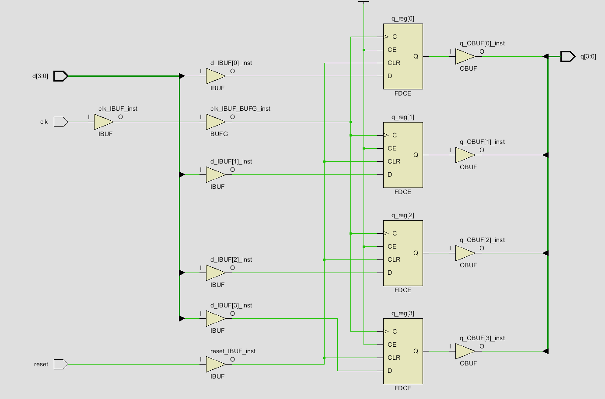
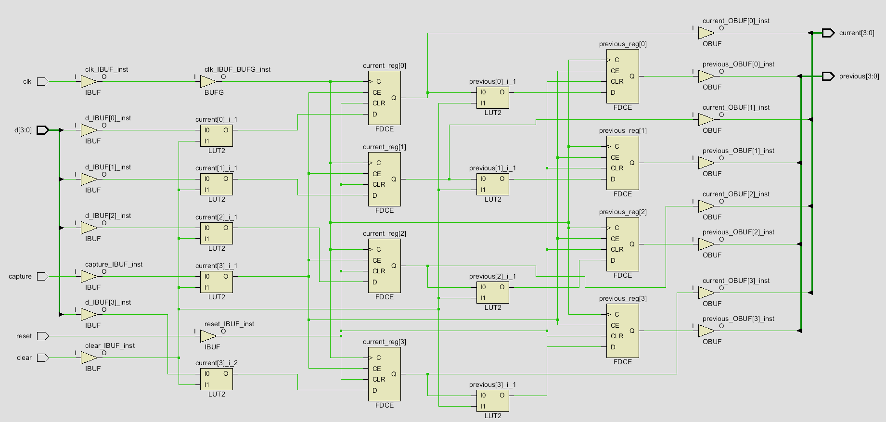
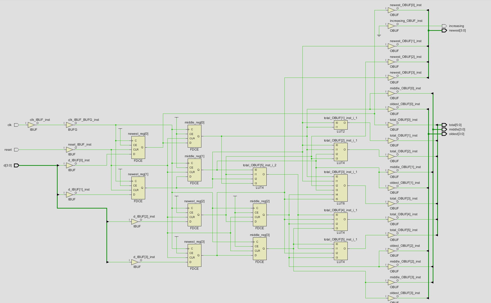
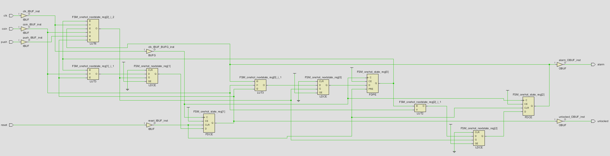
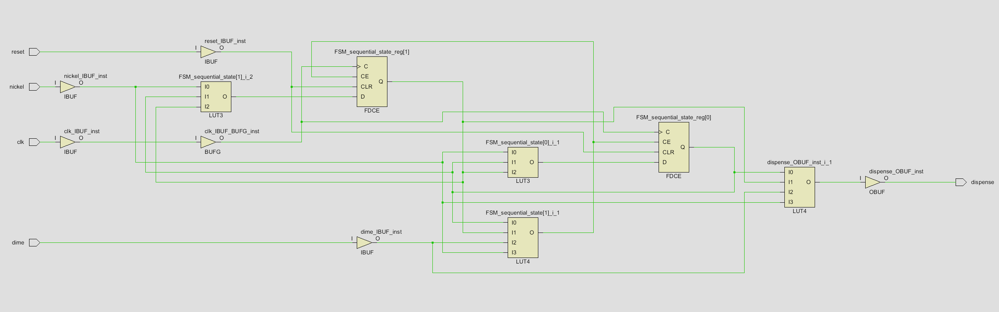

# Sequential Logic Modules

This folder contains SystemVerilog modules created while learning sequential logic from Chapter 4 of *Digital Design and Computer Architecture: RISC-V Edition*.

Sequential logic differs from combinational logic because its outputs can depend on previously stored values. These modules use flip-flops and registers that update on clock edges.

## Modules

### asyncResetRegister

Stores one input bit on the rising edge of the clock.

#### SystemVerilog
```systemverilog
module asyncResetRegister(
    input logic clk,
    input logic reset,
    input logic [3:0] d,
    output logic [3:0] q
);

always_ff @(posedge clk, posedge reset)
    if (reset) q <= 4'b0000;
    else q <= d;

endmodule
```

#### Synthesis Result


### sampleHistoryRegister

Implements two 4-bit registers that store the two most recently captured input values.

- current stores the newest captured value.
- previous stores the value that was previously held in current.
- reset asynchronously clears both registers.
- clear synchronously clears both registers.
- capture enables a new value to be stored.
- When capture is low, both registers retain their existing values.

#### SystemVerilog

```systemverilog
module sampleHistoryRegister(
    input  logic       clk,
    input  logic       reset,
    input  logic       clear,
    input  logic       capture,
    input  logic [3:0] d,
    output logic [3:0] current,
    output logic [3:0] previous
);

    always_ff @(posedge clk, posedge reset) begin
        if (reset) begin
            current  <= 4'b0000;
            previous <= 4'b0000;
        end
        else if (clear) begin
            current  <= 4'b0000;
            previous <= 4'b0000;
        end
        else if (capture) begin
            previous <= current;
            current  <= d;
        end
    end

endmodule
```

#### Synthesis Result



### threeSampleAnalyzer

Stores the three most recelty capture 4-bit inputs and analyzes them.

- newest stores the most recently caputred input.
- middle stores the previous value of newest.
- oldest stoeres the previous value of middle.
- The registers update together on each rising clock edge using nonblocking assignments.
- reset asynchronously clears all three registers.
- total is the sum of the three stored samples.
- increasing is high when (newest > middle > oldest).
- The combinational calculations use blocking assignments because later calculations depend on earlier intermediate results.

#### SystemVerilog

```systemverilog
module threeSampleAnalyzer(
    input logic clk,
    input logic reset,
    input logic [3:0] d,

    output logic [3:0] newest,
    output logic [3:0] middle,
    output logic [3:0] oldest,
    /* Since the sum of 3 inputs of 4 bits wide can 
    add up to 45 the total needs to be 6 bits wide */ 
    output logic [5:0] total,
    output logic increasing
);

    logic [5:0] partialSum;

always_ff @(posedge clk, posedge reset) begin
    if (reset) begin
        newest <= 4'b0000;
        middle <= 4'b0000;
        oldest <= 4'b0000; 
    end
    else begin
    newest <= d;
    middle <= newest;
    oldest <= middle; 
    end
end 

always_comb begin
    partialSum = newest + middle;
    total = partialSum + oldest;

    increasing = ((newest > middle) && (middle > oldest));
    end
endmodule
```

#### Synthesis Result



### mooreTurnstile

Implements a Moore finite state machine that controls a turnstile with locked, unlocked, and alarm states.

- S0 represents the locked state.
- S1 represents the unlocked state.
- S2 represents the alarm state.
- Inserting a coin while locked moves the FSM to the unlocked state.
- Pushing while unlocked moves the FSM back to the locked state.
- Pushing while locked moves the FSM to the alarm state.
- The alarm state lasts for one clock cycle before automatically returning to the locked state.
- Inserting a coin while already unlocked keeps the FSM unlocked.
- unlocked and alarm depend only on the current state, making this a Moore FSM.
- reset asynchronously returns the FSM to the locked state.

#### SystemVerilog

```systemverilog
module mooreTurnstile(
    input  logic clk,
    input  logic reset,
    input  logic coin,
    input  logic push,
    output logic unlocked,
    output logic alarm
);

    typedef enum logic [1:0] {S0, S1, S2} statetype;
    statetype state, nextstate;

    // State register
    always_ff @(posedge clk, posedge reset) begin
        if (reset)
            state <= S0;
        else
            state <= nextstate;
    end

    // Next-state logic
    always_comb begin
        nextstate = state;

        case (state)
            S0: begin
                if (coin)
                    nextstate = S1;
                else if (push)
                    nextstate = S2;
            end

            S1: begin
                if (coin)
                    nextstate = S1;
                else if (push)
                    nextstate = S0;
            end

            S2: begin
                nextstate = S0;
            end

            default: begin
                nextstate = S0;
            end
        endcase
    end

    // Moore output logic
    always_comb begin
        unlocked = 1'b0;
        alarm    = 1'b0;

        case (state)
            S0: begin
                unlocked = 1'b0;
                alarm    = 1'b0;
            end

            S1: begin
                unlocked = 1'b1;
                alarm    = 1'b0;
            end

            S2: begin
                unlocked = 1'b0;
                alarm    = 1'b1;
            end

            default: begin
                unlocked = 1'b0;
                alarm    = 1'b0;
            end
        endcase
    end

endmodule
```

#### Synthesis Result



### mealyVendingMachine

Implements a Mealy finite state machine for a vending machine that dispenses an item after receiving at least 15 cents.

- S0 represents 0 cents of stored credit.
- S1 represents 5 cents of stored credit.
- S2 represents 10 cents of stored credit.
- nickel adds 5 cents to the current credit.
- dime adds 10 cents to the current credit.
- When the total reaches at least 15 cents, dispense becomes high during the same cycle.
- After dispensing, the FSM returns to S0.
- When no coin is inserted, the FSM remains in its current state.
- dispense depends on both the current state and the coin inputs, making this a Mealy FSM.
- reset asynchronously returns the FSM to the 0-cent state.
- The design assumes nickel and dime are not high during the same cycle.

#### SystemVerilog

```systemverilog
module mealyVendingMachine(
    input  logic clk,
    input  logic reset,
    input  logic nickel,
    input  logic dime,
    output logic dispense
);

    typedef enum logic [1:0] {S0, S1, S2} statetype;
    statetype state, nextstate;

    // State register
    always_ff @(posedge clk, posedge reset) begin
        if (reset)
            state <= S0;
        else
            state <= nextstate;
    end

    // Next-state and Mealy output logic
    always_comb begin
        nextstate = state;
        dispense  = 1'b0;

        case (state)
            S0: begin
                if (nickel)
                    nextstate = S1;
                else if (dime)
                    nextstate = S2;
            end

            S1: begin
                if (nickel)
                    nextstate = S2;
                else if (dime) begin
                    dispense  = 1'b1;
                    nextstate = S0;
                end
            end

            S2: begin
                if (nickel || dime) begin
                    dispense  = 1'b1;
                    nextstate = S0;
                end
            end

            default: begin
                nextstate = S0;
                dispense  = 1'b0;
            end
        endcase
    end

endmodule
```

#### Synthesis Result

