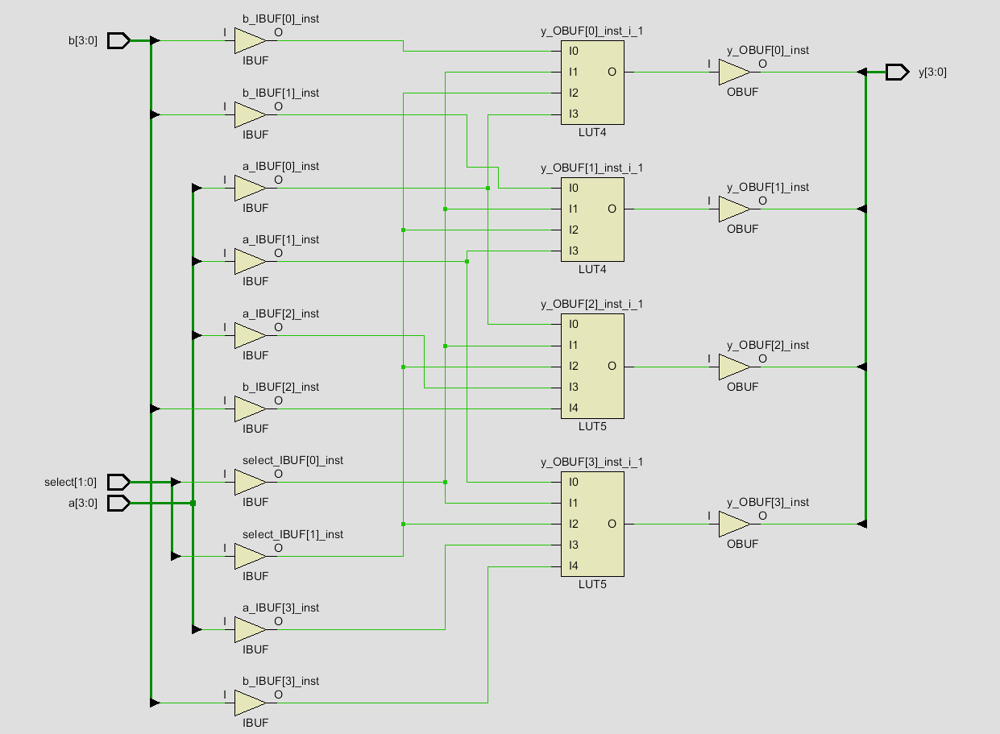
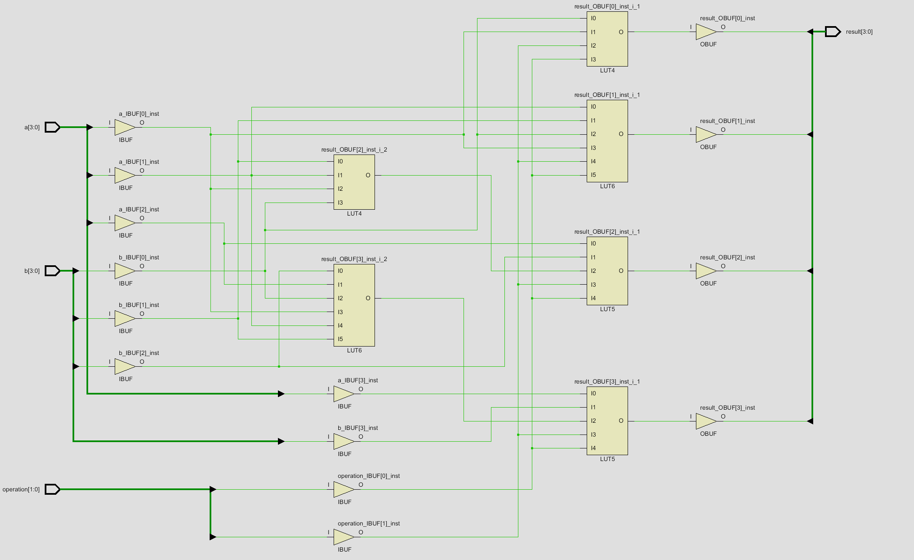

# Modules

## myFirstModule

Implements a combinational Boolean function with three 1-bit inputs and one 1-bit output.

### SystemVerilog

```systemverilog
assign y = (~a & ~b & ~c) |
           ( a & ~b & ~c) |
           ( a & ~b &  c);
```

### Synthesis Result


### reductionOperators 

Uses the SystemVerilog reduction AND operator to combine all eight bits of the input into one output.

### SystemVerilog

```systemverilog
assign y = &a;
```

This is equivalent to:

```systemverilog
assign y = a[7] & a[6] & a[5] & a[4] &
           a[3] & a[2] & a[1] & a[0];
```

### Synthesis Result 


## functionSelector

Implements a 4-bit combinational function selector. A 2-bit select input chooses which operation is performed on the two 4-bit inputs, a and b. 

### SystemVerilog

```systemverilog
module functionSelector(
    input  logic [3:0] a,
    input  logic [3:0] b,
    input  logic [1:0] select,
    output logic [3:0] y
);

    assign y =
        (select == 2'b00) ? (a & b) :
        (select == 2'b01) ? (a | b) :
        (select == 2'b10) ? (a ^ b) :
        {a[1:0], b[1:0]};

endmodule
```

### Synthesized Result



## miniAlu

Implements a 4-bit combinational arithmetic logic unit that performs one of four operations based on a 2-bit operation selector.

- 00 bitwise AND.
- 01 bitwise OR.
- 10  bitwise XOR.
- 11  4-bit addition.
- The output changes whenever an input or the operation selector changes.
- The module does not store any previous values.

### SystemVerilog

```systemverilog
module miniAlu(
    input  logic [3:0] a,
    input  logic [3:0] b,
    input  logic [1:0] operation,
    output logic [3:0] result
);

    always_comb begin
        case (operation)
            2'b00: result = a & b;
            2'b01: result = a | b;
            2'b10: result = a ^ b;
            2'b11: result = a + b;
            default: result = 4'b0000;
        endcase
    end

endmodule
```
### Testbench

The testbench manually applies one test case for each supported operation.

Each test:
- assigns values to a, b, and operation,
- waits 10 ns for the combinational output to update,
- compares result with a manually calculated expected value,
- prints an error message when the output is incorrect.

- The !== case-inequality operator is used so that unknown (x) or high-impedance (z) outputs are also treated as failures.

### SystemVerilog

```systemverilog
`timescale 1ns/1ps 

module miniALU_tb;

    logic [3:0] a;
    logic [3:0] b;
    logic [1:0] operation;
    logic [3:0] result;

    miniAlu dut (
        .a(a),
        .b(b),
        .operation(operation),
        .result(result)
    );

    initial begin

        // test 1: AND
        a = 4'b0011;   // 3
        b = 4'b0101;   // 5
        operation = 2'b00;
        #10;

        if (result !== 4'b0001)
            $display(
                "AND failed: a=%b b=%b result=%b expected=%b", a, b, result, 4'b0001
            );

        // test 2: OR
        a = 4'b0011;
        b = 4'b0101;
        operation = 2'b01;
        #10;

        if (result !== 4'b0111)
            $display (
                "OR failed: a=%b b=%b result=%b expected=%b", a, b, result, 4'b0111
            );

        //test 3: XOR
        a = 4'b1011;
        b = 4'b0101;
        operation = 2'b10;
        #10;

        if (result !== 4'b1110)
            $display(
                "XOR failed: a=%b b=%b result=%b expected=%b", a, b, result, 4'b1110
            );

        //test 4: ADD
        a = 4'b0011;   // 3
        b = 4'b0101;   // 5
        operation = 2'b11;
        #10;

        if (result !== 4'b1000)
            $display(
                "ADD failed:  a=%b b=%b result=%b expected=%b", a, b, result, 4'b1000
            );
        
        $display("Testing complete.");
        $finish;
    end

endmodule    
```

### Running the Testbench

From the miniAlu folder, compile the DUT and testbench together:

```powershell
iverilog -g2012 -s miniALU_tb -o miniALU_tb.vvp src\miniAlu.sv testbench\miniALU_tb.sv
```

Run the compiled simulation:

```powershell
vvp miniALU_tb.vvp
```

When all tests pass, the simulation prints:

```powershell
Testing complete.
```

If a result is incorrect, the testbench prints the operation, inputs, actual result, and expected result.

### Synthesis Result


