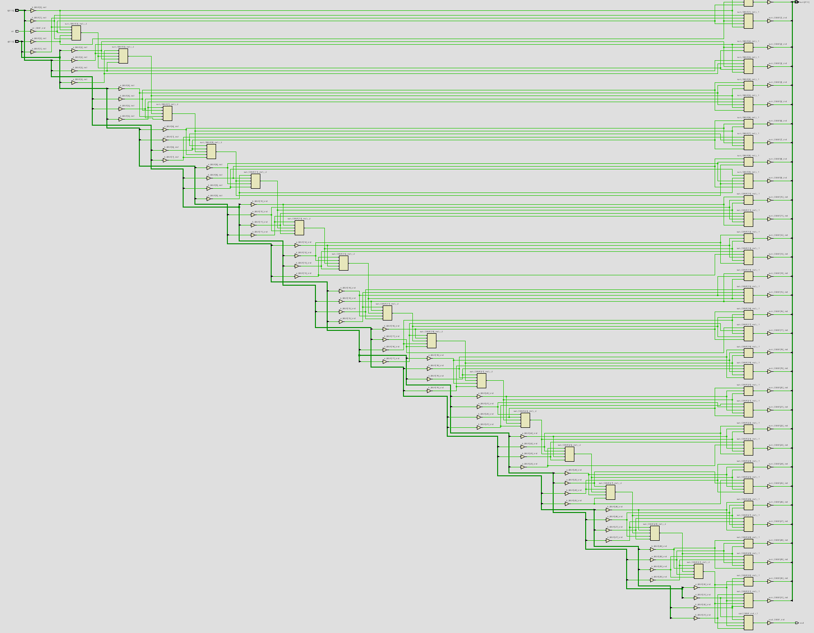

# Modules

## fullAdder

Implements a one-bit full adder.

The module adds three one-bit inputs:

- a
- b
- cin

It produces:

- sum, the least-significant bit of the result
- cout, the carry bit

### SystemVerilog

```systemverilog
module fullAdder(
    input  logic a,
    input  logic b,
    input  logic cin,
    output logic sum,
    output logic cout
);

assign sum  = a ^ b ^ cin;

assign cout = (a & b) | (a & cin) | (b & cin);

endmodule
```

## rippleAdder

Implements a parameterized ripple-carry adder using multiple instances of the fullAdder module.

The default width is 32 bits, but the WIDTH parameter can be changed when the module is instantiated.

Each generated full-adder stage operates on one bit of a and b. The carry output from stage i is connected to the carry input of stage i + 1.

The internal carry bus contains WIDTH + 1 signals:

carry[0] receives the external cin
carry[1] through carry[WIDTH-1] connect adjacent full adders
carry[WIDTH] becomes the final cout

### SystemVerilog

```systemverilog
module rippleCarryAdder #(
    parameter int WIDTH = 32
)(
    input  logic [WIDTH - 1:0] a,
    input  logic [WIDTH - 1:0] b,
    input  logic cin,
    output logic [WIDTH - 1:0] sum,
    output logic cout
);

// Internal carry signals
logic [WIDTH:0] carry;

// Connect external carry-in
assign carry[0] = cin;

genvar i;

generate
    for (i = 0; i < WIDTH; i++) begin : adderStages

         fullAdder fa (
            .a (a[i]),
            .b (b[i]),
            .cin (carry[i]),
            .s (sum[i]),
            .cout (carry[i+1])
        );
    end
endgenerate

// Connect final carry out to cout
assign cout = carry[WIDTH];

endmodule
```

### Testbench

The testbench instantiates the ripple carry adder and applies 10000 random sample input values to verify its basic operation.

For each test it:

- generates random values for a and b,
- randomly selects cin to 0 or 1,
- calculatioes the expected result with SystemVerilog addition,
- compares the expected result with {cout, sum} (concatenation)

The operands are extended by one bit before addition to preseve the final carry bit:

### SystemVerilog

```systemverilog
expected = {1'b0, a} + {1'b0, b} + cin;

This allows the complete result to be compared against {cout, sum}.

### SystemVerilog

```systemverilog
module rippleAdder_tb;

localparam int WIDTH = 32;

logic [WIDTH-1:0] a;
logic [WIDTH-1:0] b;
logic             cin;
logic [WIDTH-1:0] sum;
logic             cout;

logic [WIDTH:0] expected;

rippleCarryAdder #(
    .WIDTH(WIDTH)
) dut (
    .a    (a),
    .b    (b),
    .cin  (cin),
    .sum  (sum),
    .cout (cout)
);

initial begin
    repeat (10000) begin
        a   = $urandom;
        b   = $urandom;
        cin = $urandom_range(0, 1);

        #1;

        expected = {1'b0, a} + {1'b0, b} + cin;

        if ({cout, sum} !== expected) begin
            $fatal( 1, "Mismatch: a=%h b=%h cin=%b, got=%h expected=%h", a, b, cin, {cout, sum}, expected
            );
        end
    end

    $display("All random tests passed.");
    $finish;
end

endmodule
```
### Running the Testbench

From the rippleAdder folder, compile the full adder, ripple-carry adder, and testbench together:

```powershell
iverilog -g2012 -s rippleAdder_tb -o rippleAdder_tb.vvp src\fullAdder.sv src\rippleAdder.sv testbenches\rippleAdder_tb.sv
```

Run the compiled simulation:

```powershell
vvp rippleAdder_tb.vvp
```

When all tests pass, the simulation prints:

```powershell
All random tests passed.
```

If a test fails, the testbench prints the values of a, b, and cin, along with the actual and expected results.

### Synthesis Result



## claAdder

Implements a four-bit carry-lookahead adder.

The module calculates generate and propagate signals for each bit:

- g[i] indicates that bit i generates a carry on its own
- p[i] indicates that bit i propagates an incoming carry

Unlike a ripple-carry adder, each carry equation is expanded so that it does not depend directly on the previous carry signal. This allows the carry signals to be calculated in parallel from the generate signals, propagate signals, and cin.

The internal carry bus contains five signals:

c[0] receives the external cin  
c[1] through c[3] are the carry inputs for the remaining bit positions  
c[4] becomes the final cout

Each sum bit is calculated using its corresponding carry input.

### SystemVerilog

```systemverilog
module claAdder(
    input logic [3:0] a,
    input logic [3:0] b,
    input logic cin,
    output logic [3:0] sum,
    output logic cout
);

logic [3:0] g;
logic [3:0] p;
logic [4:0] c;


assign p = a | b;
assign g = a & b;

assign c[0] = cin;
assign c[1] = g[0] | (p[0] & c[0]);
assign c[2] = g[1] | p[1] & (g[0] | (p[0] & c[0]));
assign c[3] = g[2] | p[2] & (g[1] | p[1] & (g[0] | (p[0] & c[0])));
assign c[4] = g[3] | p[3] & (g[2] | p[2] & (g[1] | p[1] & (g[0] | (p[0] & c[0]))));

assign sum = a ^ b ^ c[3:0];

assign cout = c[4];

endmodule
```

### Testbench

The testbench instantiates the carry-lookahead adder and exhaustively tests every possible input combination.

The four-bit inputs a and b each have 16 possible values, while cin has two possible values. This gives:

16 × 16 × 2 = 512

total test cases.

Three nested loops are used to test every combination of a, b, and cin.

For each test it:

- assigns the current loop values to a, b, and cin,
- waits for the combinational logic to settle,
- calculates the expected result with SystemVerilog addition,
- compares the expected result with {cout, sum}.

The operands are extended by one bit before addition to preserve the final carry bit:

```systemverilog
expected = {1'b0, a} + {1'b0, b} + cin;
```

This allows the complete result to be compared to {cout, sum} (concatenation).

### SystemVerilog

```systemverilog
module claAdder_tb;

logic [3:0] a;
logic [3:0] b;
logic cin;

logic [3:0] sum;
logic cout;

logic [4:0] expected;

claAdder dut(
    .a(a),
    .b(b),
    .cin(cin),
    .sum(sum),
    .cout(cout)
);

initial begin
    for (int ai = 0; ai < 16; ai++) begin
        for (int bi = 0; bi < 16; bi++) begin
            for (int ci = 0; ci < 2; ci++) begin
                a = ai;
                b = bi;
                cin = ci;

                #1;

                expected = {1'b0, a} + {1'b0, b} + cin;

                if ({cout, sum} !== expected) begin
                    $fatal( 1, "Mismatch: a=%b b=%b cin=%b got=%b expected=%b", a, b, cin, {cout, sum}, expected
                    );
                end
            end
        end
    end

    $display("All CLA tests passed.");
    $finish;
end

endmodule
```

### Running the Testbench

From the claAdder folder, compile the carry-lookahead adder and testbench together:

```powershell
iverilog -g2012 -s claAdder_tb -o claAdder_tb.vvp src/claAdder.sv testbenches/claAdder_tb.sv
```

Run the compiled simulation:

```powershell
vvp claAdder_tb.vvp
```

When all tests pass, the following is printed:

```powershell
All CLA tests passed.
```

If a test fails, the testbench prints the values of a, b, and cin, along with the actual and expected results.